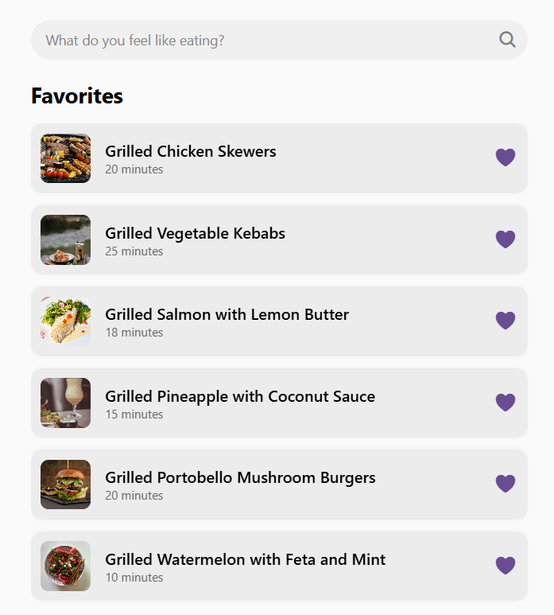
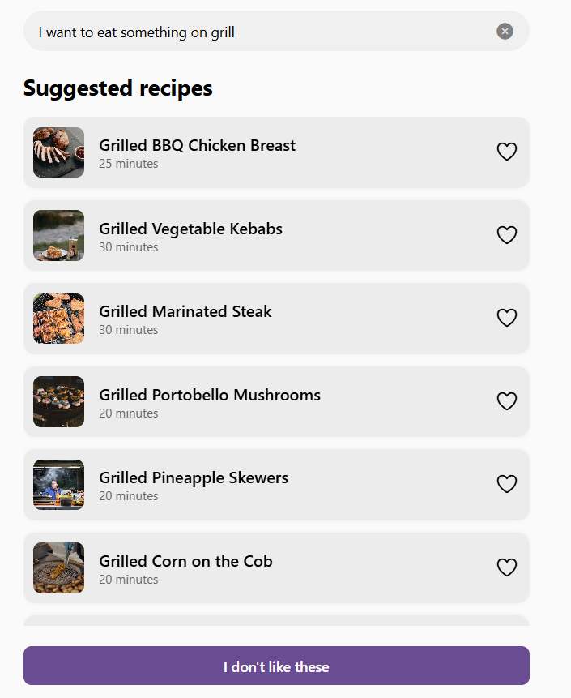
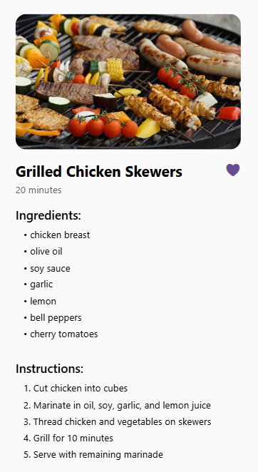
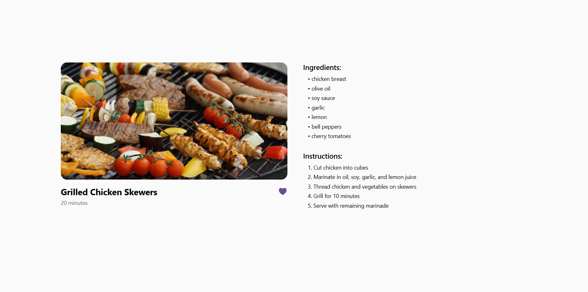

# AI Recipe App

A cross-platform mobile app built with React Native, Expo Router that helps users discover AI-generated recipes with images and easy-to-follow instructions.

### RESULTS: 

### ### Follow these steps to run the project locally:

### 1. Clone the Repository

git clone https://github.com/Radu309/RecipeFinder.git
cd RecipeFinder

### 2. Install Dependencies

npm install
# or
yarn

### 3. Install Expo CLI (if not already installed)

npm install -g expo-cli

### 4. Start the Project

-- for mobile:  
npx expo start

-- for web:  
npx expo start --web

Use Expo Go on your phone (recommanded) or an emulator to preview the app.

## Requirements

- Node.js
- Git
- Expo CLI
- Mobile device with Expo Go or a local emulator
- Code editor (e.g. VSC)

## Project Structure

.

├── app/                   # App routes (Expo Router)

├── components/            # UI components

├── hooks/                 # Reusable logic for states, effects, or data

├── services/              # API integrations

├── types/                 # TypeScript definitions

├── utils/                 # Local storage, helpers
